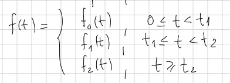

# ODE HELPER

a project created to help me to solve differential equations and related topics.

the program solves the equation in steps and uses Wolfram|Alpha for solving repetitive problems such as integrals and derivatives.

the code has been tested in a few scenarios and may not work, besides the way of solving the ode is tied to my university.

### Dependencies

The only dependency is selenium 3.141.0

### Documentation

all commands have the following structure,

```
python ode3.py <request> <arg1> <arg2> <argn>.....
```

the expressions are written as if you were in wolfram-alpha, also ode's must be written in prime notation.

##### Cauchy Euler

give you the 'm' solutions of the auxiliar equation

```
cauchy-euler <homogeneous-ode>
```

* homogeneous-ode: the left member of the equation, because it's homogeneous and we are going to solve the auxiliar equation

examples:

```
python ode3.py cauchy-euler "4x^2y'' + 17y"
python ode3.py cauchy-euler "x^3y''' + 5x^2y'' + 7xy' + 8y"
```

##### Parameter Variation

give you the 'u' solutions to create the particular solution

```
parameter-variation-n <fx> <sol1> <sol2> <sol3>...
```

* fx: the function in the right member of the equation, what makes the ode no homogeneous
* sol1,sol2,sol3: solutions of the associated homogeneous ode

examples:

```
python ode3.py parameter-variation-n "(x + 1)e^(2x)" "e^(2x)" "xe^(2x)"
python ode3.py parameter-variation-n "csc(3x)/4" "cos(3x)" "sin(3x)"
```

##### Laplace Lineal

solve a constant coefficients equation using laplace

```
laplace-lineal <homogeneous-ode> <fx> <pvi1> <pvi2>...
```

* homogeneous-ode: the left member of the equation
* fx: the function in the right member of the equation, what makes the ode no homogeneous
* pvi: ode pvi

examples:

```
python ode3.py laplace-lineal "y' + 3y" "13sin(2t)" "y(0)=1"
python ode3.py laplace-lineal "y'' - 3y' + 2y" "e^(-4t)" "y(0)=1" "y'(0)=5"
```


##### Compact Function

compact a function by parts using the heaviside step function

the structure of the function by parts is the following



```
compact-function <part1> <part2> <part3...>
```

* parts: function-Anumber pair that represents the function by parts

examples:

```
python ode3.py compact-function "2,0" "-1,2" "0,3"
python ode3.py compact-function "20t, 0" "0, 5"
```

##### Laplace Property

tries to apply one of the following properties

* translation theorem 1
* translation theorem 2
* inverse translation theorem 2

```
laplace-property <expression>
```

* expression: the function f(t) or F(s)

examples:

```
python ode3.py laplace-property "3t*u(t-1)"
python ode3.py laplace-property "e^(5t)t^3"
python ode3.py laplace-property "e^(-2t)cos(4t)"
python ode3.py laplace-property "e^(-pis)/(s^2+1)"
python ode3.py laplace-property "t^2*sin(t)"
```

